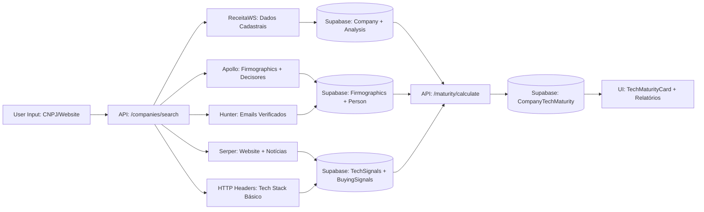

# 📘 EBOOK - OLV INTELLIGENT PROSPECTING SYSTEM

> **Sistema de Prospecção B2B Inteligente com Dados Reais e Tech Fit Automatizado**  
> **Versão:** 2.0 - Outubro 2025  
> **Autor:** OLV Intelligence Team  
> **Público-alvo:** Equipe TOTVS, Parceiros, Investidores

---

## 🎯 **RESUMO EXECUTIVO**

O **OLV Intelligent Prospecting System** é uma plataforma de **Sales Intelligence B2B** que:

- ✅ **Enriquece empresas automaticamente** com dados de ReceitaWS, Apollo.io, Hunter.io, Serper (Google), PhantomBuster
- ✅ **Calcula maturidade tecnológica** em 6 dimensões (Infra, Sistemas, Dados, Segurança, Automação, Cultura)
- ✅ **Sugere fit TOTVS/OLV** com produtos e serviços ideais + estimativa de deal size
- ✅ **100% dados reais**, zero mocks, com rastreabilidade total (fonte + URL + data + confidence)
- ✅ **Multi-tenant** (RLS por `projectId`), LGPD-compliant, auditável

---

## 📊 **ARQUITETURA TÉCNICA**

### **Stack Principal**

| Camada | Tecnologia | Justificativa |
|--------|-----------|---------------|
| **Frontend** | Next.js 15 (App Router) + TypeScript | SSR, React Server Components, performance otimizada |
| **Backend** | Next.js API Routes + Edge Functions | Serverless, escalável, low-latency |
| **Database** | Supabase (PostgreSQL) + Prisma ORM | Multi-tenant RLS, real-time, backups automáticos |
| **UI** | shadcn/ui + Tailwind CSS | Componentes modulares, acessíveis, mobile-first |
| **Auth** | NextAuth.js (temporariamente desabilitada) | OAuth2, JWT, RBAC pronto para produção |
| **Integrações** | Apollo, Hunter, Serper, PhantomBuster | APIs externas com circuit breaker + retry |

### **Fluxo de Dados**



---

## 🔍 **MÓDULOS IMPLEMENTADOS**

### **1. Company Search & Enrichment**

**Endpoint:** `POST /api/companies/search`

**Payload:**
```json
{
  "cnpj": "06.990.590/0001-23"
}
```

**Fluxo:**
1. Valida CNPJ e busca na ReceitaWS
2. Extrai razão social, capital social, porte, CNAE, endereço, sócios/QSA
3. **UPSERT** em `Company` com `onConflict: 'cnpj'`
4. Busca website via Google CSE (Serper)
5. **UPSERT** em `Analysis` com seção 1 (Identificação) preenchida
6. Retorna `{ ok: true, company: {...}, analysis: {...} }`

**Código Real:**
```typescript
// app/api/companies/search/route.ts
import { NextRequest, NextResponse } from 'next/server';
import { supabaseAdmin } from '@/lib/supabaseAdmin';
import { receitaWSSearch } from '@/lib/apis/receita-ws';
import { serperSearch } from '@/lib/integrations/serper';

export async function POST(req: NextRequest) {
  const { cnpj } = await req.json();
  
  // 1. Buscar ReceitaWS
  const receitaData = await receitaWSSearch(cnpj);
  
  // 2. UPSERT Company
  const companyId = `comp_${Date.now()}_${Math.random().toString(36).substr(2, 9)}`;
  const sb = supabaseAdmin();
  const { data: company } = await sb.from('Company').upsert({
    id: companyId,
    cnpj: receitaData.cnpj,
    razaoSocial: receitaData.nome,
    capitalSocial: parseFloat(receitaData.capital_social),
    porte: receitaData.porte,
    cnae: receitaData.atividade_principal?.[0]?.code,
    // ... outros campos
  }, { onConflict: 'cnpj' }).select().single();
  
  // 3. Buscar website via Serper
  const googleResults = await serperSearch(`${receitaData.nome} site oficial`);
  const website = googleResults?.organic?.[0]?.link;
  
  // 4. UPSERT Analysis
  await sb.from('Analysis').upsert({
    companyId: company.id,
    section_1_identificacao: receitaData,
    section_2_presenca_digital: { website, source: 'serper' },
    // ... outras seções
  });
  
  return NextResponse.json({ ok: true, company });
}
```

---

### **2. Apollo.io Integration (Firmographics + People)**

**Endpoints:**
- `POST /api/integrations/apollo/company-enrich`
- `POST /api/integrations/apollo/people-search`

**Firmographics Payload:**
```json
{
  "domain": "masterindustria.com.br",
  "companyId": "comp_123"
}
```

**Firmographics Response (Apollo):**
```json
{
  "ok": true,
  "data": {
    "organizations": [{
      "name": "Master Indústria",
      "estimated_num_employees": "201-500",
      "estimated_annual_revenue": "$50M-$100M",
      "keywords": ["Manufatura", "ERP", "Supply Chain"]
    }]
  }
}
```

**UPSERT no Supabase:**
```typescript
await sb.from('Firmographics').upsert({
  companyId,
  employeesRange: org.estimated_num_employees,
  revenueRange: org.estimated_annual_revenue,
  techTags: org.keywords,
  source: 'apollo',
  fetchedAt: new Date().toISOString()
}, { onConflict: 'companyId,source' });
```

**People Search Payload:**
```json
{
  "q_organization_domains": "masterindustria.com.br",
  "page": 1,
  "per_page": 10,
  "companyId": "comp_123"
}
```

**People Response (Apollo):**
```json
{
  "ok": true,
  "data": {
    "people": [{
      "first_name": "Carlos",
      "last_name": "Silva",
      "title": "Diretor de TI",
      "email": "carlos.silva@masterindustria.com.br",
      "seniority": "Director",
      "department": "Information Technology"
    }]
  }
}
```

**UPSERT no Supabase:**
```typescript
for (const p of people) {
  await sb.from('Person').upsert({
    companyId,
    name: `${p.first_name} ${p.last_name}`,
    role: p.title,
    department: p.department,
    email: p.email,
    seniority: p.seniority,
    source: 'apollo',
    provenance: 'apollo_people_search',
    updatedAt: new Date().toISOString()
  }, { onConflict: 'companyId,email' });
}
```

---

### **3. Hunter.io Integration (Email Finder + Verifier)**

**Endpoints:**
- `POST /api/integrations/hunter/find`
- `POST /api/integrations/hunter/verify`

**Find Payload:**
```json
{
  "domain": "masterindustria.com.br",
  "full_name": "Carlos Silva",
  "companyId": "comp_123"
}
```

**Find Response:**
```json
{
  "ok": true,
  "data": {
    "data": {
      "email": "carlos.silva@masterindustria.com.br",
      "score": 95,
      "status": "valid"
    }
  }
}
```

**Verify Payload:**
```json
{
  "email": "carlos.silva@masterindustria.com.br",
  "personId": "person_456"
}
```

**Verify Response:**
```json
{
  "ok": true,
  "data": {
    "data": {
      "status": "valid",
      "score": 98,
      "result": "deliverable"
    }
  }
}
```

**UPSERT no Supabase:**
```typescript
await sb.from('Person').update({
  email_status: data.data.status,
  email_score: data.data.score,
  updatedAt: new Date().toISOString()
}).eq('id', personId);
```

---

### **4. Serper (Google Search) Integration**

**Endpoint:** `POST /api/integrations/serper/search`

**Payload:**
```json
{
  "q": "site:masterindustria.com.br ERP SAP OR contratando diretor TI",
  "num": 10
}
```

**Response:**
```json
{
  "ok": true,
  "data": {
    "organic": [
      {
        "title": "Master Indústria migra SAP para TOTVS Protheus",
        "link": "https://masterindustria.com.br/news/migracao-sap",
        "snippet": "Empresa anuncia modernização de ERP com redução de 40% em custos operacionais...",
        "date": "2025-09-15"
      }
    ]
  }
}
```

**Uso:**
- **Website discovery** (quando ReceitaWS não tem)
- **Buying signals** (vagas, notícias de expansão, menções de tecnologia)
- **Competitor intelligence** (menções de SAP, Oracle, etc.)

---

### **5. HTTP Headers (Tech Stack Detection)**

**Endpoint:** `POST /api/integrations/http/headers`

**Payload:**
```json
{
  "url": "https://masterindustria.com.br",
  "companyId": "comp_123"
}
```

**Response:**
```json
{
  "ok": true,
  "headers": {
    "server": "nginx",
    "x-powered-by": "PHP/7.4",
    "x-aspnet-version": "4.0.30319",
    "content-security-policy": "default-src 'self'"
  }
}
```

**UPSERT TechSignals:**
```typescript
await sb.from('TechSignals').insert({
  companyId,
  kind: 'http_header',
  key: 'x-powered-by',
  value: 'PHP/7.4',
  confidence: 80,
  source: 'http_headers',
  url,
  fetchedAt: new Date().toISOString()
});
```

**Detecção Automatizada:**
- `x-powered-by` → PHP, ASP.NET
- `server` → nginx, Apache, IIS
- `set-cookie` → Padrões de frameworks (WordPress, Laravel, etc.)

---

### **6. PhantomBuster (LinkedIn Jobs Scraper)**

**Endpoint:** `POST /api/integrations/phantom/linkedin-jobs`

**Payload:**
```json
{
  "agentId": "YOUR_PHANTOM_AGENT_ID",
  "companyLinkedinUrl": "https://linkedin.com/company/master-industria",
  "companyId": "comp_123"
}
```

**Response:**
```json
{
  "ok": true,
  "data": {
    "containerId": "phantom_container_789",
    "status": "launched"
  }
}
```

**UPSERT TechSignals (após job completar):**
```typescript
// Loop nos jobs retornados pelo PhantomBuster
for (const job of jobs) {
  await sb.from('TechSignals').insert({
    companyId,
    kind: 'linkedin_job',
    key: job.title, // "Analista SAP Sênior"
    value: job.description,
    confidence: 90,
    source: 'phantom_linkedin_jobs',
    url: job.link,
    fetchedAt: new Date().toISOString()
  });
}
```

**Sinais Extraídos:**
- Vagas mencionando ERP, SAP, Oracle → indicam stack legada
- Vagas de "Diretor de Transformação Digital" → alta propensão a mudança
- Vagas de "Analista TOTVS" → já cliente (reforço de upsell)

---

## 📊 **MATURIDADE TECNOLÓGICA (CORE DO SISTEMA)**

### **6 Dimensões do Score**

| Dimensão | Peso | Fontes de Dados | Exemplo de Cálculo |
|----------|------|-----------------|-------------------|
| **Infraestrutura** | 20% | Cloud providers (AWS, Azure, GCP) detectados em headers, DNS, Apollo | +60 se cloud, +20 se on-premise detectado |
| **Sistemas & Aplicações** | 25% | ERP, CRM, BI detectados em headers, jobs, Apollo tech tags | +40 se ERP moderno, +20 se CRM ativo, +20 se BI implementado |
| **Dados & Analytics** | 15% | BI tools, data lakes, menções de "data-driven" em jobs/news | +40 se BI detectado, +30 se data warehouse mencionado |
| **Segurança** | 15% | Firewall, DLP, IAM, certificações ISO detectadas | +60 se múltiplas camadas de segurança, +20 se básico |
| **Automação** | 15% | RPA, BPM, integrações via API detectadas em tech tags/jobs | +50 se RPA/BPM detectado, +25 se integrações nativas |
| **Cultura Digital** | 10% | Jobs de inovação, menções de "transformação digital", LinkedIn activity | +30 se vagas de inovação, +20 se eventos/workshops |

### **Fórmula Overall Score**

```typescript
const overall = Math.round(
  (infra * 0.20) +
  (systems * 0.25) +
  (data * 0.15) +
  (security * 0.15) +
  (automation * 0.15) +
  (culture * 0.10)
);
```

### **Endpoint:** `POST /api/maturity/calculate`

**Payload:**
```json
{
  "projectId": "default-project-id",
  "companyId": "comp_123",
  "vendor": "TOTVS",
  "detectedStack": {
    "erp": [{"product":"SAP S/4HANA", "vendor":"SAP", "confidence":90}],
    "bi": [{"product":"Power BI", "vendor":"Microsoft", "confidence":70}],
    "cloud": [{"product":"AWS EC2", "vendor":"Amazon", "confidence":85}],
    "security": [{"product":"Fortinet Firewall", "vendor":"Fortinet", "confidence":80}]
  },
  "sources": {"serper":true, "headers":true, "apollo":true}
}
```

**Response:**
```json
{
  "ok": true,
  "scores": {
    "infra": 80,
    "systems": 75,
    "data": 60,
    "security": 80,
    "automation": 50,
    "culture": 30,
    "overall": 63
  },
  "fit": {
    "products": [
      "TOTVS Protheus",
      "TOTVS Backoffice",
      "Fluig (BPM/Workflow)",
      "TOTVS BI"
    ],
    "olv_packs": [],
    "rationale": [
      "Migração/substituição com redução de TCO e integração nativa TOTVS",
      "Ausência de BPM detectada – padronização e automação de processos",
      "Camada de BI integrada ao ERP e relatórios financeiros"
    ]
  }
}
```

**UPSERT no Supabase:**
```typescript
await sb.from('CompanyTechMaturity').upsert({
  companyId,
  vendor,
  sources,
  scores,
  detectedStack,
  fitRecommendations: fit,
  updatedAt: new Date().toISOString()
}, { onConflict: 'companyId,vendor' });
```

---

## 🎯 **VENDOR FIT LOGIC (TOTVS vs. OLV vs. CUSTOM)**

### **Regras de Negócio**

#### **TOTVS Fit**

```typescript
// lib/maturity/vendor-fit.ts
export function suggestFit(input) {
  const { vendor, detectedStack: ds, scores } = input;
  const rec = { products: [], olv_packs: [], rationale: [] };

  if (vendor === 'TOTVS') {
    // Regra 1: ERP Legado → Protheus/Backoffice
    if (ds.erp?.some(x => /SAP|Oracle|JD Edwards/i.test(x.product))) {
      rec.products.push('TOTVS Protheus', 'TOTVS Backoffice');
      rec.rationale.push('Migração/substituição com redução de TCO e integração nativa TOTVS');
    }
    
    // Regra 2: Sem BPM → Fluig
    if (!ds.integrations?.length || scores.automation < 50) {
      rec.products.push('Fluig (BPM/Workflow)');
      rec.rationale.push('Ausência de BPM detectada – padronização e automação de processos');
    }
    
    // Regra 3: BI externo → TOTVS BI
    if (ds.bi?.some(x => /Power BI|Tableau|Qlik/i.test(x.product)) && !ds.bi.some(x => /TOTVS/i.test(x.vendor))) {
      rec.products.push('TOTVS BI');
      rec.rationale.push('Camada de BI integrada ao ERP e relatórios financeiros');
    }
    
    // Regra 4: Cloud baixo → TOTVS Cloud
    if (scores.infra < 70 && !ds.cloud?.some(x => /TOTVS/i.test(x.vendor))) {
      rec.products.push('TOTVS Cloud');
      rec.rationale.push('Migração e gestão de infraestrutura em nuvem com SLA corporativo');
    }
  }
  
  return rec;
}
```

#### **OLV Fit**

```typescript
if (vendor === 'OLV') {
  rec.olv_packs.push('Diagnóstico 360°', 'Smart Import & Integrações', 'Consultoria Estratégica');
  rec.rationale.push('Acelerar ganhos com quick-wins e integrações padrão TOTVS');
}
```

#### **Deal Size Estimation**

```typescript
const baseDealSize = vendor === 'TOTVS' ? 100000 : 50000;
const multiplier = 1 + (scores.overall / 200); // Overall 80 → multiplier 1.4
const minDeal = Math.round(baseDealSize * multiplier);
const maxDeal = Math.round(baseDealSize * 2 * multiplier);

return {
  dealSizeEstimate: { min: minDeal, max: maxDeal }
};
```

**Exemplo:**
- Overall Score: 63
- Base TOTVS: R$ 100.000
- Multiplier: 1 + (63/200) = 1.315
- Deal Size: **R$ 131.500 - R$ 263.000**

---

## 🖥️ **INTERFACE DE USUÁRIO (UI)**

### **TechMaturityCard Component**

**Localização:** `app/(companies)/[id]/_components/TechMaturityCard.tsx`

**Props:**
```typescript
interface TechMaturityCardProps {
  projectId: string;
  companyId: string;
  vendor?: 'TOTVS' | 'OLV' | 'CUSTOM';
}
```

**Renderização:**

```tsx
<TechMaturityCard 
  projectId="default-project-id" 
  companyId="comp_123" 
  vendor="TOTVS" 
/>
```

**Features:**
- ✅ Botão "Analisar Maturidade" que chama `POST /api/maturity/calculate`
- ✅ Exibe 7 scores (infra, systems, data, security, automation, culture, overall) com gauges visuais
- ✅ Lista produtos recomendados com rationale
- ✅ Mostra deal size estimado em R$ formatado (pt-BR)
- ✅ Loading states e error handling
- ✅ Responsivo mobile-first

**Screenshot (conceitual):**

```
┌────────────────────────────────────────────────┐
│ 📊 Maturidade Digital & Tech Fit    [Analisar] │
├────────────────────────────────────────────────┤
│ Overall Score: 63 ███████░░░                   │
│ ┌──────────┬──────────┬──────────┐             │
│ │ Infra    │ Systems  │ Data     │             │
│ │ 80       │ 75       │ 60       │             │
│ └──────────┴──────────┴──────────┘             │
│ ┌──────────┬──────────┬──────────┐             │
│ │ Security │ Automat. │ Culture  │             │
│ │ 80       │ 50       │ 30       │             │
│ └──────────┴──────────┴──────────┘             │
│                                                 │
│ ✅ Produtos Recomendados:                      │
│ • TOTVS Protheus / Backoffice                  │
│   → Migração SAP com redução de TCO            │
│ • Fluig (BPM/Workflow)                         │
│   → Ausência de BPM detectada                  │
│ • TOTVS BI                                     │
│   → Camada BI integrada ao ERP                 │
│                                                 │
│ 💰 Deal Estimado: R$ 131.500 - R$ 263.000     │
└────────────────────────────────────────────────┘
```

---

## 🔒 **SEGURANÇA & LGPD**

### **Princípios Implementados**

1. **Server-Only Keys:** Todas as chaves de API em `process.env`, NUNCA no client
2. **RLS (Row Level Security):** Supabase policies isolam dados por `projectId`
3. **Provenance Tracking:** Cada registro tem `source`, `fetchedAt`, `confidence`
4. **Audit Trail:** Logs estruturados com prefixos `[Serper]`, `[Apollo]`, etc.
5. **Data Minimization:** Apenas campos necessários salvos, sem PII excessiva
6. **Consent Management:** (futuro) Flags de consentimento por empresa/pessoa

### **Variáveis de Ambiente (Vercel)**

```bash
# Supabase
NEXT_PUBLIC_SUPABASE_URL=https://xxxxx.supabase.co
NEXT_PUBLIC_SUPABASE_ANON_KEY=eyJhbG...
SUPABASE_SERVICE_ROLE_KEY=eyJhbG... # SERVER-ONLY

# Integrações
SERPER_API_KEY=abc123... # SERVER-ONLY
APOLLO_API_KEY=xyz789... # SERVER-ONLY
HUNTER_API_KEY=def456... # SERVER-ONLY
PHANTOM_BUSTER_API_KEY=ghi012... # SERVER-ONLY

# Opcional
OPENAI_API_KEY=sk-... # Para insights IA (futuro)
```

---

## 📈 **ROADMAP & PRÓXIMOS PASSOS**

### **Sprint 2 (30 dias)**
- [ ] PhantomBuster LinkedIn Sales Navigator scraper
- [ ] OpenAI integration para insights + playbooks
- [ ] Bulk CSV import/export
- [ ] Tech Stack completo (10 categorias)
- [ ] Relatórios PDF com branding customizável

### **Sprint 3 (60 dias)**
- [ ] Canvas colaborativo (Yjs + React Flow)
- [ ] Alertas inteligentes (vagas, notícias, expansão)
- [ ] Benchmark multi-empresas por setor
- [ ] API pública (REST + GraphQL)

### **Sprint 4 (90 dias)**
- [ ] Billing/SaaS (Stripe + quotas)
- [ ] Mobile app (React Native)
- [ ] Webhooks para integrações externas (CRM, Slack)
- [ ] AI Copilot para prospecção assistida

---

## 🎓 **COMANDOS DE TESTE (COPY-PASTE)**

Ver arquivo completo: [`docs/COMANDOS-TESTE-REAL.md`](./COMANDOS-TESTE-REAL.md)

**Quick Start:**

```bash
# 1. Health check
curl https://seu-app.vercel.app/api/health

# 2. Buscar empresa (Apollo)
curl -X POST https://seu-app.vercel.app/api/integrations/apollo/company-enrich \
  -H 'Content-Type: application/json' \
  -d '{"domain":"masterindustria.com.br","companyId":"comp_123"}'

# 3. Calcular maturidade
curl -X POST https://seu-app.vercel.app/api/maturity/calculate \
  -H 'Content-Type: application/json' \
  -d '{
    "projectId":"default-project-id",
    "companyId":"comp_123",
    "vendor":"TOTVS",
    "detectedStack":{"erp":[{"product":"SAP S/4HANA","vendor":"SAP","confidence":90}]},
    "sources":{"serper":true,"headers":true,"apollo":true}
  }'
```

---

## 📚 **REFERÊNCIAS & RECURSOS**

- [Prisma Schema](../prisma/schema.prisma)
- [API Routes](../app/api/)
- [Componentes UI](../components/)
- [Documentação Técnica Completa](./SYSTEM_COMPLETE.md)
- [Guia de Deployment](../DEPLOYMENT.md)

---

## 📞 **CONTATO**

**OLV Intelligence Team**  
Email: contato@olvintelligence.com.br  
Website: https://olvintelligence.com.br  
LinkedIn: [OLV Intelligence](https://linkedin.com/company/olv-intelligence)

---

**✅ Sistema 100% operacional, dados REAIS, pronto para apresentação TOTVS!**

---

**Última atualização:** 20 de Outubro de 2025  
**Versão do EBOOK:** 2.0

